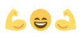
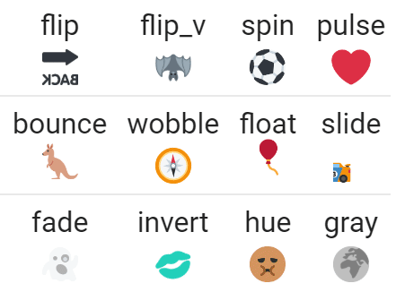
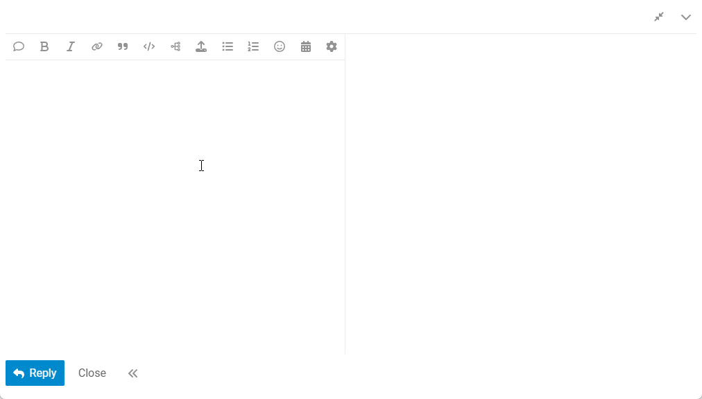
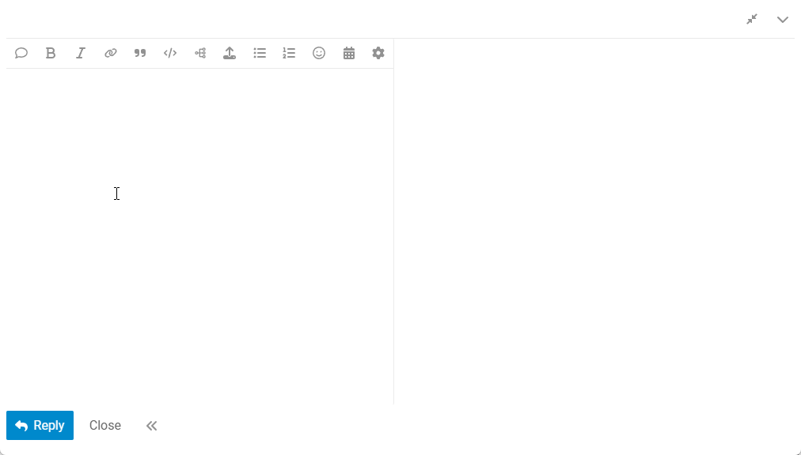
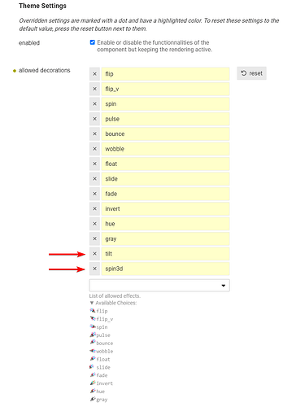

# Emoji Fluff

https://meta.discourse.org/t/emoji-fluff/339163.

## Description

Emoji Fluff allows users to put mirrored or animated emojis in their posts.
It allows users to post fancy emoji work such as:



You can set these decorations from the emoji autocompletion pop-up, from the emoji picker, or by appending keywords directly after the emoji shortcode:

Examples: `:bike:f-flip:` , `:smile:f-spin:`

Horizontal and vertical flips can be combined with other decorations.

Examples:

- `:horse:f-slide,flip:`
- `:spider:f-bounce,flip_v:`

## Screenshots



## How to add fluff to an emoji

### From the emoji autocompletion pop-up



### From the emoji picker


### By typing manually the fluff code



## Features

- Horizontally or vertically mirrored emojis
- Animated emojis (bounce, rotate, pulse, etc)
- Settings to choose which emoji variations should be available to users
- Allow admins to create new fluffs

## Settings

| Setting               |                                                                                                                                                                                                                                                                                                                                                                                                                |
| --------------------- | -------------------------------------------------------------------------------------------------------------------------------------------------------------------------------------------------------------------------------------------------------------------------------------------------------------------------------------------------------------------------------------------------------------- |
| **enabled**           | Turn on or off the component's functionalities.<br><small>Default value: `true`</small><br> Disabling will prevent the emoji decoration from being applied. <br> This is useful if you want to pause or plan to remove the component but don't want to see the decoration code, such as <code>🙂spin:</code>, in posts.<br> For more information, check out <em>Reverting emoji decorations</em> in the topic. |
| **allow decorations** | List of allowed decorations. <br><small>Default value: <code>flip\|flip_v\|spin\|pulse\|bounce\|wobble\|float\|slide\|fade\|invert\|hue\|gray</code></small>                                                                                                                                                                                                                                                   |
| **allow selector in** | Where the fluff selector should be available.<br><small>Default value: `both`</small><br>`none` -- disable the selectors.<br>`both` -- enable the selector in the autocomplete and the emoji picker.<br>`autocomplete` -- enable the selector only in the autocomplete.<br>`emoji-picker` -- enable the selector only in the emoji picker.<br>                                                                 |

Additionally, the theme component strings are translatable from the settings.

## Reverting emoji decorations

If you disable the component, these suffixes remain, resulting in emojis like this: :smile: f-spin:

Due to theme component limitations and design choices, we add straightforward suffixes to emojis to give them these decorative effects. The fluff prefix `f-` helps identify these decorations, making them easy to remove through the script available below.

You can download and run a rake task to remove fluff suffixes definitely from posts.

```bash
wget -P lib/tasks/ https://raw.githubusercontent.com/Arkshine/discourse-emoji-fluff/refs/heads/main/tasks/fluff.rake
rake fluff:delete_all
```

ℹ️ The rake task doesn't create post revisions by default. You can add `false` as an argument to change this behavior: `rake fluff:delete_all[false]`

Read https://meta.discourse.org/t/administrative-bulk-operations/118349?u=canapin for instructions on entering the container to run the rake task.

⚠️ **Always make a backup before running this task. There is no guarantee that it won't remove unwanted strings. Use it at your own risk, and review the code if in doubt.**

## How to create your own fluffs

When an emoji is altered with a fluff it is wrapped by a new `<span>` tag:

```html
<span class="fluff fluff--bounce">
  
</span>
```

You can add your custom fluff CSS in your theme or a new component. Here are two examples of new fluff.

### Tilt 90° an emoji


```scss
.fluff--tilt img {
  transform: rotate(90deg);
}
```

### Do a 3D spin effect


```scss
.fluff--spin3d img {
  animation: f-spin3d 2s infinite linear;
}

@keyframes f-spin3d {
  0% {
    transform: perspective(50em) rotateY(0deg);
    filter: brightness(1);
  }
  50% {
    transform: perspective(50em) rotateY(90deg);
    filter: brightness(0.85);
  }
  51% {
    transform: perspective(50em) rotateY(91deg);
    filter: brightness(1.15);
  }
  100% {
    transform: perspective(50em) rotateY(180deg);
    filter: brightness(1);
  }
}
```

Then, you need to add the fluff suffix in the Emoji Fluff **allowed decorations**:



That's all, your new fluffs should now be available to users. Enjoy!

ℹ️ If you change your mind and want to revert your new fluffs after users have already used it, the [rake task](#reverting-emoji-decorations) must be updated to add your new suffixes.
